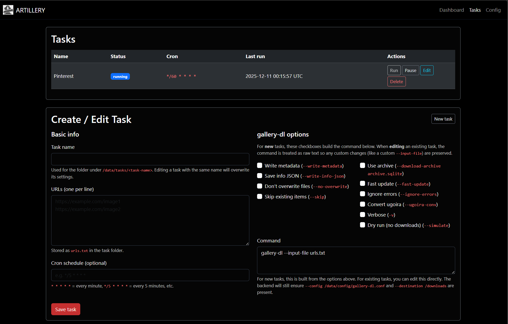

# Artillery

Artillery is a Flask-powered web UI for managing `gallery-dl` download tasks. It lets you create, edit, schedule, and manually run gallery-dl jobs from a modern, dark-themed interface—complete with logging, archiving, and task control.


## 🚀 Features

- 🔧 Task creation with full gallery-dl command customization
- 🕓 Interval-based scheduling handled by a Python watcher
- 📜 Task logging with live command output
- 📁 Automatic archive handling
- 🧠 Pause/resume functionality
- ✅ Docker-ready with Gunicorn + Supervisor

## 🖥️ Interface

### Task List
Easily view all configured tasks, run status, last execution time, and direct access to logs or edit actions.



### Create/Edit Tasks
Configure gallery URLs and fine-tune flags like rate limits, retries, sleep intervals, and output formats.


---

## 🐳 Docker

```bash
docker run -d \
  -p 8080:8000 \
  -e PUID=1000 \
  -e PGID=1000 \
  -v /path/to/tasks:/tasks \
  -v /path/to/downloads:/downloads \
  -v /path/to/logs:/logs \
  -v /path/to/config:/config \
  -e GALLERY_DL_AUTOUPDATE=false \
  --name artillery \
  your-artillery-image
```

The entrypoint ensures `/config`, `/logs`, `/tasks`, and `/downloads` exist (creating them when necessary) before launching Supervisor. Gunicorn serves the Flask UI on port `8000`, while the background watcher handles scheduled tasks and the recent-images refresher keeps homepage thumbnails fresh.

Set `GALLERY_DL_AUTOUPDATE=true` if you want the container to pull the newest `gallery-dl` on startup; it is `false` by default to keep boots fast when network access is slow or unavailable.

## 🛠️ Local development

```bash
python -m venv .venv
source .venv/bin/activate
pip install -r requirements.txt
export FLASK_APP=app:create_app
flask run --host=0.0.0.0 --port=8000
```

Scheduler/watcher helpers use the same directories as the container build (`/tasks`, `/downloads`, `/logs`, `/config`). You can override them with environment variables if you prefer local paths.
