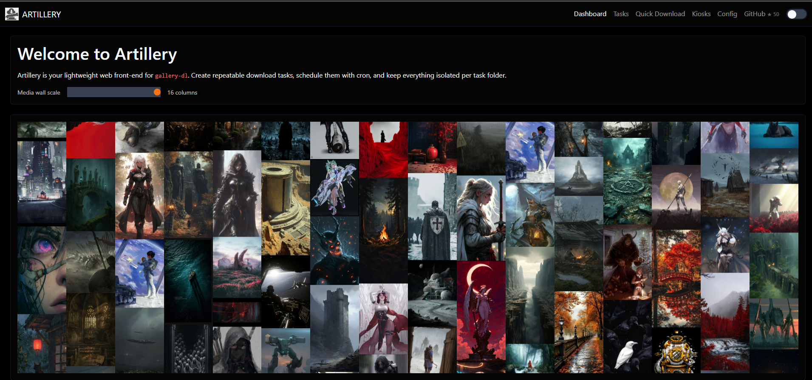
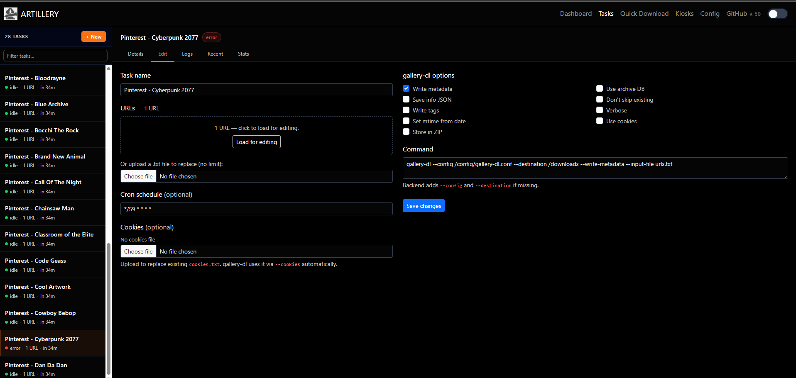
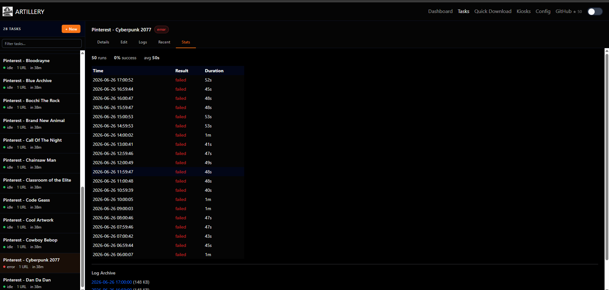
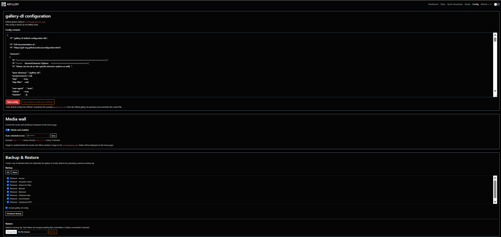
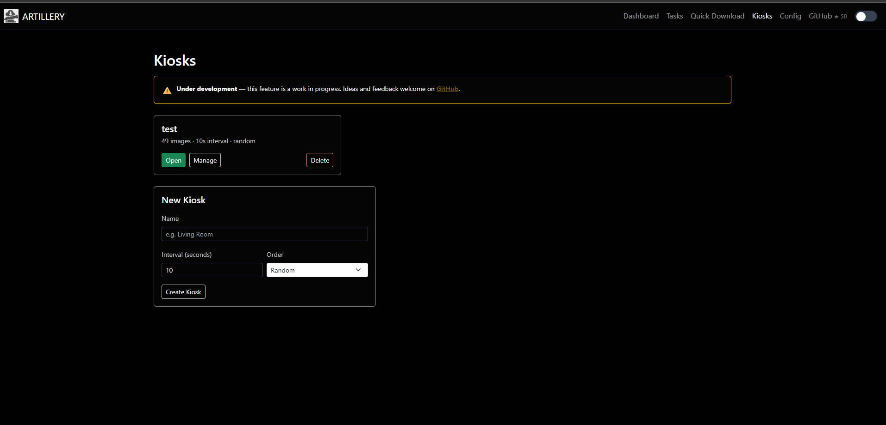

# Artillery

A web UI for [gallery-dl](https://github.com/mikf/gallery-dl). Create download tasks, schedule them, watch them run. Built to live in Docker on Unraid.



---

## What it does

- **Tasks** — give a task a name, a list of URLs, and a cron schedule. Artillery runs gallery-dl for you and keeps the logs.
- **Media wall** — the dashboard shows a scrolling wall of your recent downloads so you can see what came in.
- **Quick download** — one-off download without creating a task.
- **Stats** — per-task run history, success/fail tracking, and downloadable archived logs.
- **Config** — edit your `gallery-dl.conf` from the browser. Backup and restore tasks + config as a zip.
- **Kiosks** *(early)* — upload images and display them fullscreen in a browser. Good for a Pi on a TV.

---

## Screenshots

| | |
|---|---|
|  |  |
|  |  |

---

## Docker

```bash
docker run -d \
  --name artillery \
  -p 8088:80 \
  -e PUID=99 \
  -e PGID=100 \
  -v /mnt/user/appdata/artillery/config:/config \
  -v /mnt/user/appdata/artillery/tasks:/tasks \
  -v /mnt/user/pictures:/downloads \
  obviousviking/artillery
```

| Volume | Purpose |
|---|---|
| `/config` | gallery-dl config, task schedules, kiosk data |
| `/tasks` | one folder per task — logs, URLs, run history |
| `/downloads` | where gallery-dl puts files |

gallery-dl updates itself on container start.

---

## Unraid

Install from Community Applications. Map `/config` and `/tasks` to appdata, `/downloads` to wherever your media lives. Set PUID/PGID to match your Unraid user (usually 99/100).

---

## Kiosk mode (dedicated display)

Open a kiosk URL in Chromium with `--kiosk` and it runs fullscreen with no browser chrome:

```bash
# Linux / Raspberry Pi
chromium-browser --kiosk --incognito "http://your-server/kiosk/name"

# Windows
"C:\Program Files\Google\Chrome\Application\chrome.exe" --kiosk "http://your-server/kiosk/name"
```

The manage page generates these commands for you.

---

## Stack

Flask · gunicorn · gallery-dl · APScheduler · Bootstrap 5 · Docker
