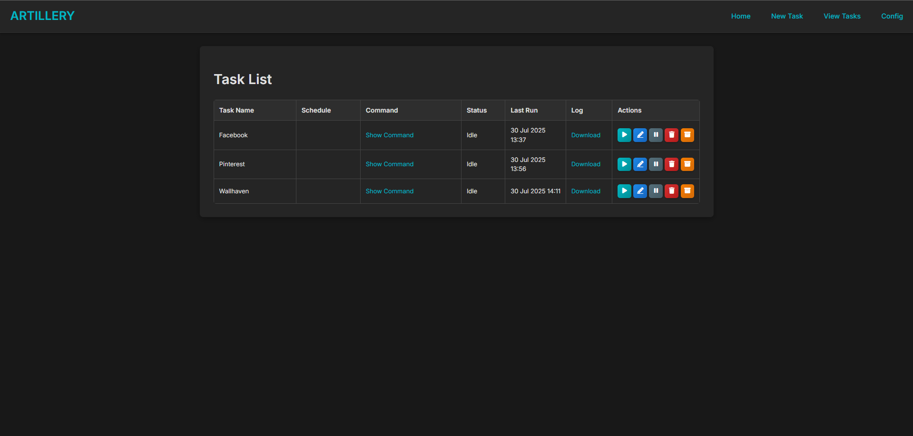

# Artillery

**Artillery** is a sleek web UI for managing `gallery-dl` download tasks. It lets you create, edit, schedule, and manually run gallery-dl jobs from a modern, dark-themed interface—complete with logging, archiving, and task control.


## 🚀 Features

- 🔧 Task creation with full gallery-dl command customization
- 🕓 Interval-based scheduling (every X minutes)
- 📜 Task logging with live command output
- 📁 Automatic archive handling
- 🧠 Pause/resume functionality
- ✅ Docker-ready

## 🖥️ Interface

### Task List
Easily view all configured tasks, run status, last execution time, and direct access to logs or edit actions.



### Create/Edit Tasks
Configure gallery URLs and fine-tune flags like rate limits, retries, sleep intervals, and output formats.


---

## 🐳 Docker

```bash
docker run -d \
  -p 8080:80 \
  -e PUID=1000 \
  -e PGID=1000 \
  -v /path/to/tasks:/tasks \
  -v /path/to/downloads:/downloads \
  -v /path/to/logs:/logs \
  -v /path/to/config:/config \
  --name artillery \
  your-artillery-image
